# ACTIVITAT 7 M07 Ahmed Aziz 

Captures de pantalla a README.md amb els comentaris

## Captura 1: Configuración de Docker

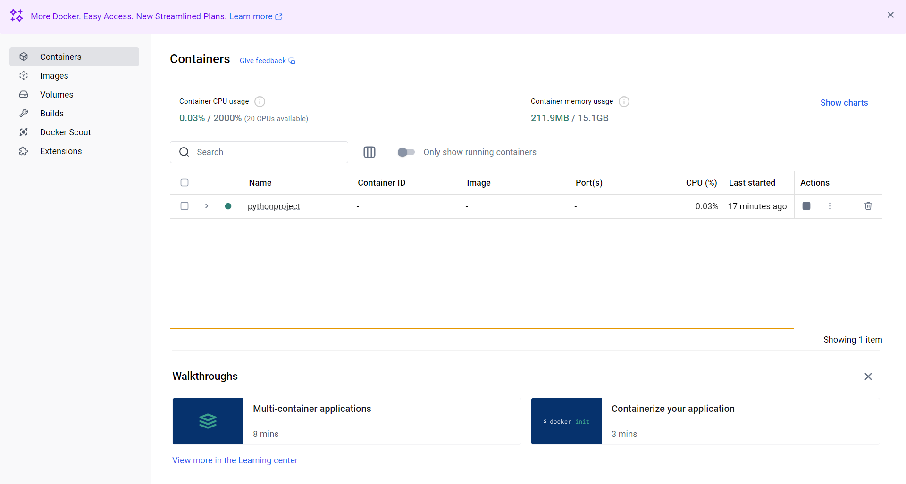

Descripció: Aquesta es una captura en el docker ya esta conectat amb el projecte a PyCharm.

## Captura 2: Docker configurat i creat a PyCharm

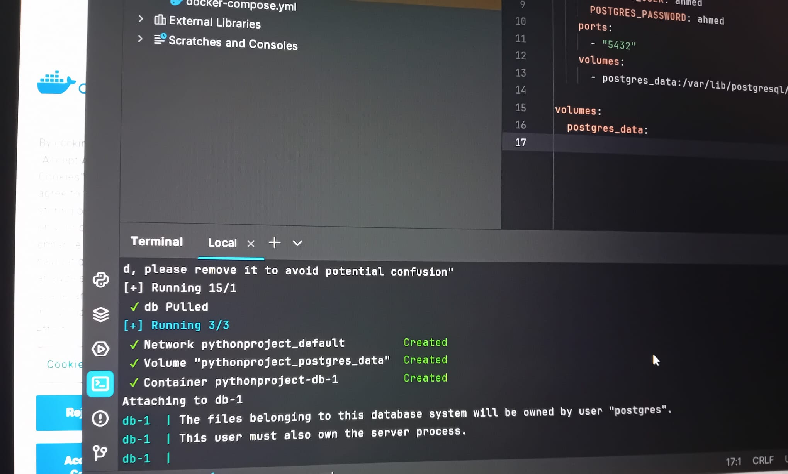
Descripció:Ya tenim  creat la connexio amb postgres i la base de dades.

## Captura 2.1: Docker Funcionant

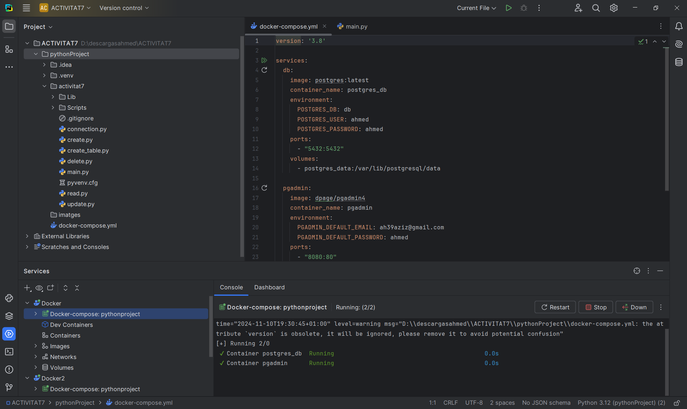
Descripció:Ya tenim el docker posat a Pycharm i tot pujat i conectat amb el postrgres i la base de dades.

## Captura 3: Connexió realitzada

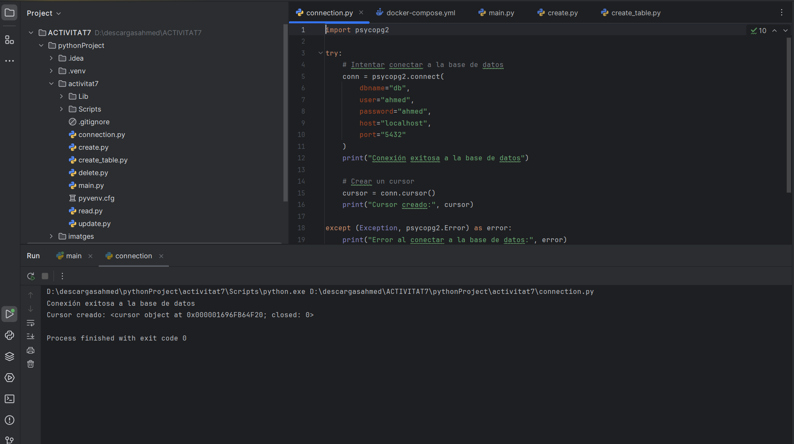
Descripció:Ya tenim la connexió realitzada i ens entra i tanca la base de dades .

## Captura 4: La creació de taules

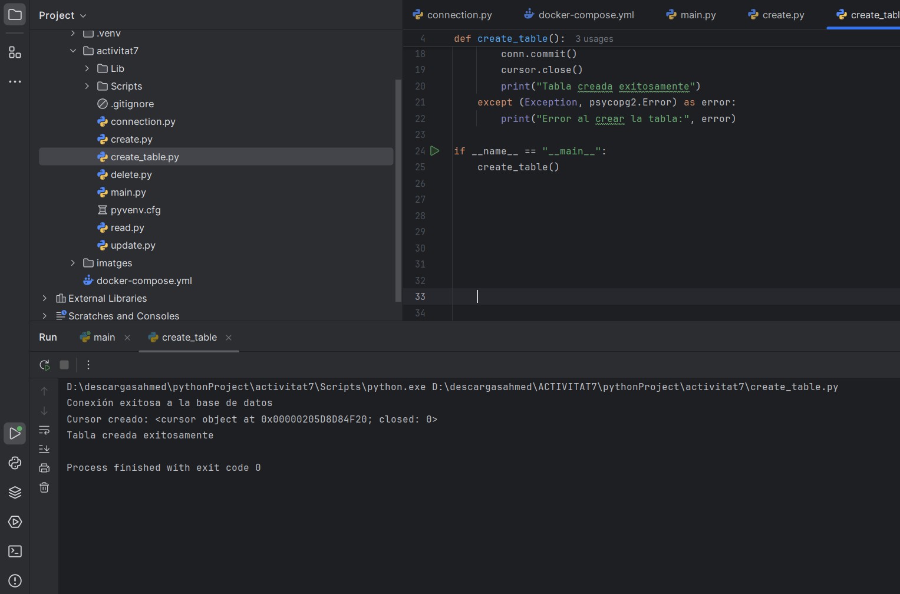
Descripció:Per crear les taules la composicio de les taules,assignant el seu tipus :int,date,boolean,etc.

## Captura 5: Crear registres

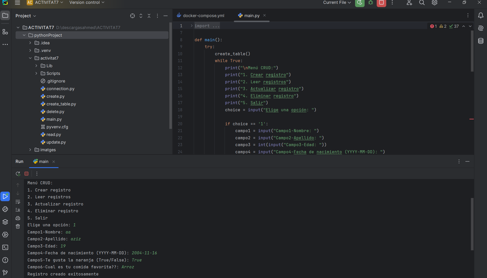
Descripció: Aqui tenim per fer cada registre en donara un formulari de 6 caselles en el nostre cas nom,cognom,edad,etc.I haurem de posar les dades a terminal i aixo ens posara tot a l taula,les dades a la taula,un insert segons el camp.

## Captura 6: Llegir el registre

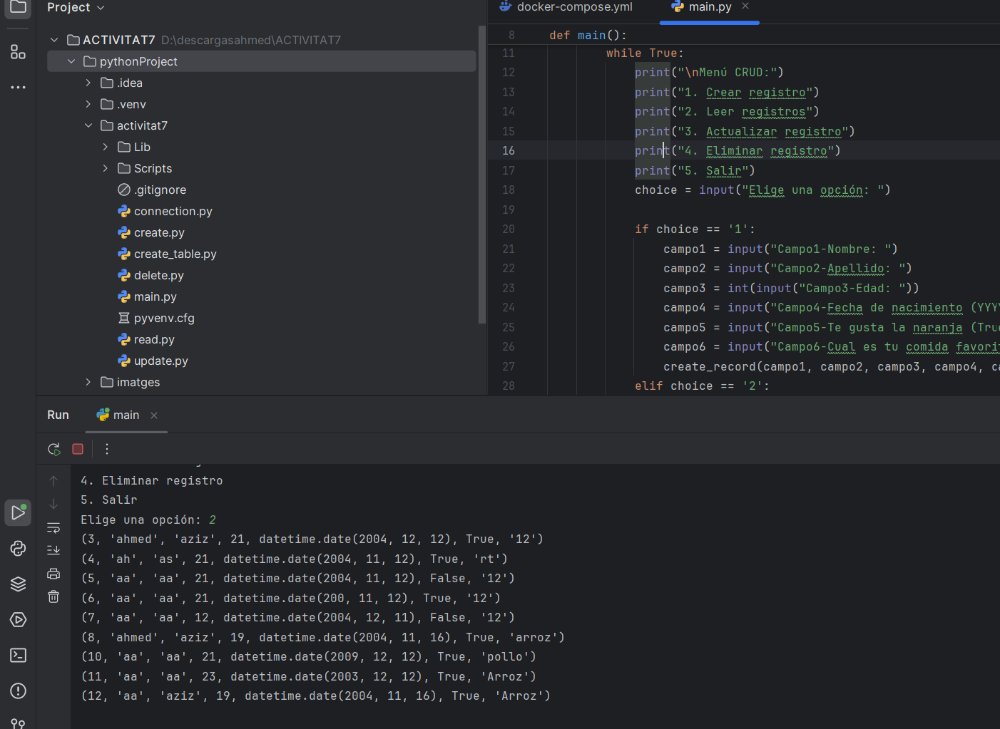
Descripció: Aqui tenim per llegir tots el registres que hem fet en algun moment,amb una consulta.

## Captura 7: Actualitzar els registres

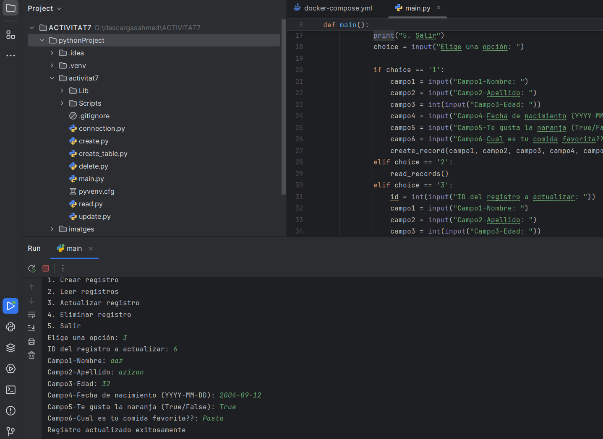
Descripció:Una vegada tenim els registres fets lo que podem fer es actualitzar-los de manera que sobrescibim les dades que teniam per unes altres.

## Captura 8: Eliminar registre

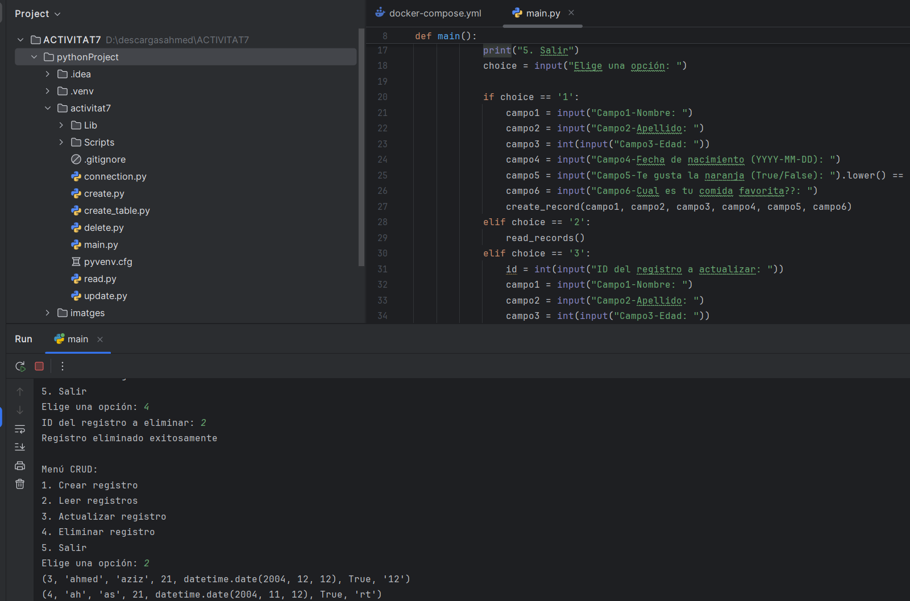
Descripció:Lo que fa el delete es eliminar un registre creat anteriorment,lo que es fa es que es busca la fila i la seva id per consulta i se elimina.

## Captura 9: Connexió a PgAdmin

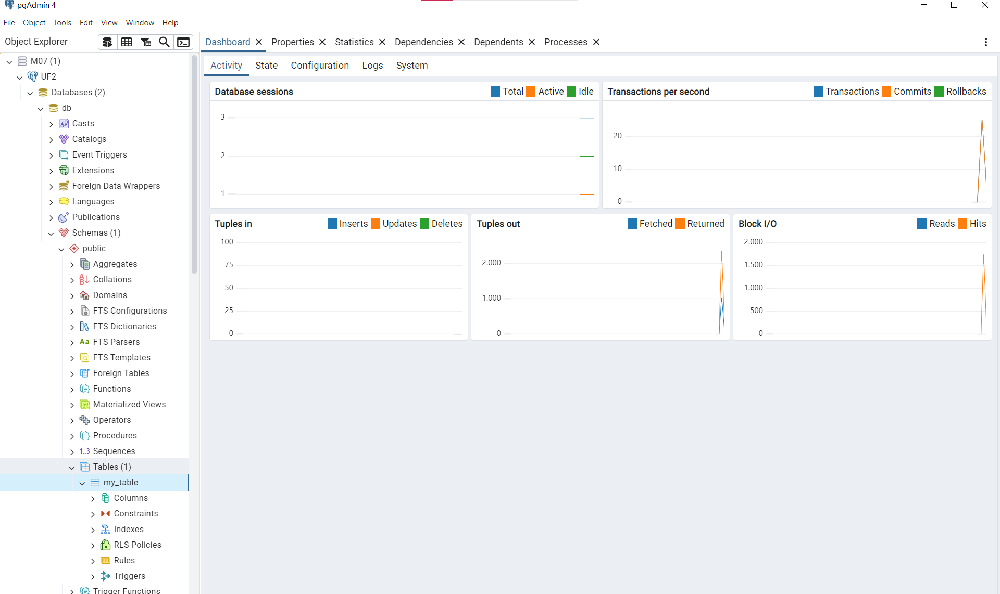
Descripció: Ya tenin la creació de la taula i tenin insertada la taula una vegada conectada amb docker,postgres i Pycharm.Taula creada. 

## Captura 10: Taula creada

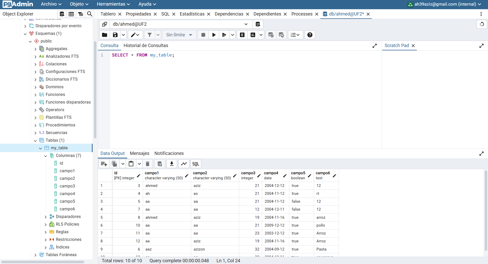
Descripció: Ja tenim la taula amb el registres creats a pgadmin on podem fer consultes del registres creats des de Pycharm.

